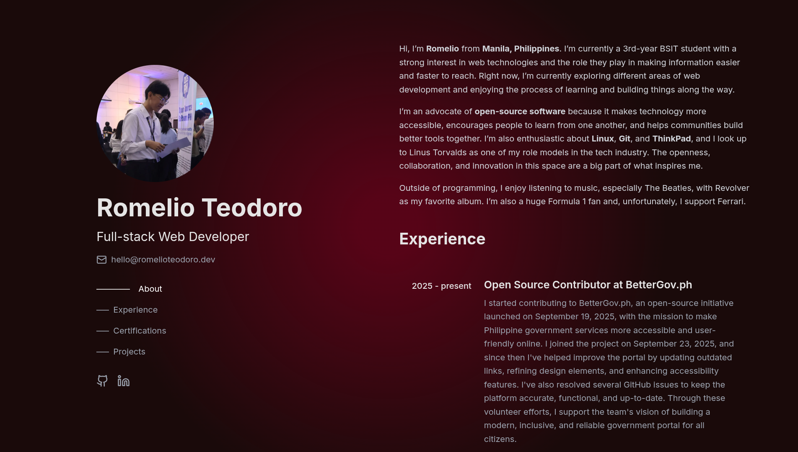

# Personal Portfolio Website

This is my personal portfolio website built to present my background, experience, certifications, and selected projects in one place. I love this layout because visitors can keep scrolling while still seeing my name, profile, and key links.

## Tech Stack

- React 18
- Tailwind CSS
- Vite
- Lucide React
- GitHub Pages

## Design Inspiration

This design is heavily inspired by [Brittany Chiang](https://brittanychiang.com/), then adapted and refined with my own content and styling decisions.
